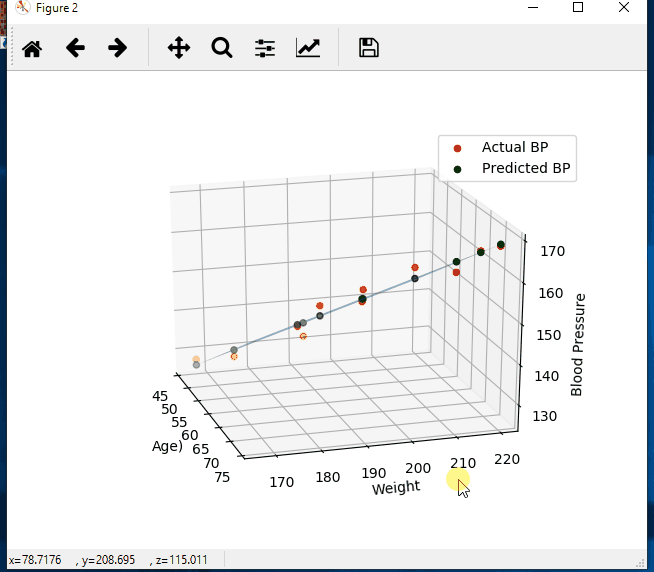
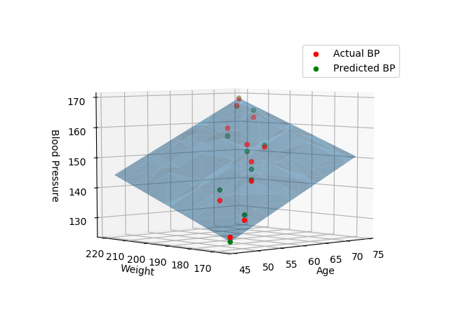

# Multiple linear regression with Python, numpy, matplotlib, plot in 3d
 
Background info / Notes:
 
Equation: 
Multiple regression: Y = b0 + b1*X1 + b2*X2 + ... +bnXn 
compare to Simple regression: Y = b0 + b1*X 
 
In English:  
Y is the predicted value of the dependent variable 
X1 through Xn are n distinct independent variables 
b0 is the value of Y when all of the independent variables (X1 through Xn) are equal to zero 
b1 through bn are the slope of the relationship between the dependent variable and the independed variable that is holding constant of all other independent variables. 
 
Think of it as a system of equations: 
Y1 = (b + mX1) + e1 
Y2 = (b + mX2) + e2 
... 
Yn = (b + mXn) + en 
We can then set up a matrix equation with the following matrices: 
 
&nbsp; &nbsp; &nbsp; &nbsp;|Y1| 
Y = |......| 
&nbsp; &nbsp; &nbsp; &nbsp;|Yn| 
 
&nbsp; &nbsp; &nbsp; &nbsp;|1 X1| 
X = |... ...| 
&nbsp; &nbsp; &nbsp; &nbsp;|1 Xn| 
 
&nbsp; &nbsp; &nbsp; &nbsp;|b| 
A = |m| 
 
&nbsp; &nbsp; &nbsp; &nbsp;|e1| 
E = |......| 
&nbsp; &nbsp; &nbsp; &nbsp;|en| 
 
Which gives us the matrix equation: Y = XA + E 
We just need to solve for A 
 
Use Linear Algebra to solve 
Equation:  
A = (X^T * X)^-1 * (X^T * Y)  
 
Two helpful links that explain how we get this equation: 
https://www.youtube.com/watch?v=Qa_FI92_qo8 
https://www.youtube.com/watch?v=qdOG7YMolmA 
 
Convert the equation to code: 
Using the np.linalg.solve function we will not need to invert the first term 
a = np.linalg.solve(np.dot(X.T, X), np.dot(X.T, Y)) 
 

 

 

